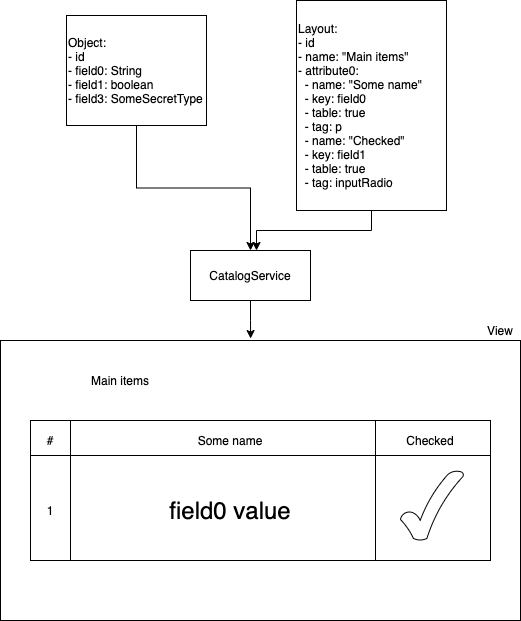

# KeepUP CMS 2.0 library


### Main benefits:

* reactive
* durable
* scalable
* provides entities extension without data source stand-in

## Modules

## 1. Core

Core modules contains basic set of entities and services for KeepUP based applications.

## 1.1 Profiles

Yet there are only two profiles as there is no possibility to use the source as the separate library.

Dev - profile for local application launch with local cache.
H2 - profile with already connected in-memory H2 database working in PostgreSQL mode

## 1.2 Security

Flags and profiles

Security rules

## 1.3 Web requests customization

CSRF protection can be disabled in the settings (e.g. application.properties):

```
keepup.security.csrf-enabled=false
```

By default CSRF is enabled.

Limit on the number of bytes that can be buffered whenever the input stream needs to be aggregated for web requests can 
be also customized by setting value of keepup.web.codecs.max-memory-size property:

```
keepup.web.codecs.max-memory-size=100000
```

Default value is 8192 bytes.

## 1.4 Managing custom user objects

Usually, in order to write a well-functioning and easily maintainable application, you need to control objects, their field types, possible operations, and other things. It is quite difficult to do this using the standard set of entities of the KeepUP framework, which is based on abstraction that implements the io.keepup.cms.core.persistence.Content interface. Therefore, we added an additional abstract service, from which you can inherit your class, which will manage operations on objects of the type you need:

```Java
public abstract class EntityOperationServiceBase<T> implements EntityService<T>`
```
        
T is the type of your object. For example, if you have an entity of type Customer, it is enough to create a class and mark it as a Spring managed bean, and you will have a service that provides CRUD operations on the desired entity.

```Java
@Service
public class CustomerOperationService extends EntityOperationServiceBase<Customer> {}
```

Any types can be used as object fields, but if they do not implement the Serializable interface, then when the object is saved, such fields will be wrapped in Proxy objects that implement this interface.

To map the primary identifier to the field of your object, use the @ContentId annotation, and to map a regular field, use the @ContentMapping annotation.

#### Example:

```Java
public class TestEntity implements Serializable {


    @ContentId
    private Long testId;

    @ContentMapping("some_value")
    private String someValue;
}
```

Please note that entities are being converted taking into account that if there is no such field or if the field has another type then the field in the entity will be null but the whole entity is not filtered. You can add additional filter to the reactive chain if you want to add some nullability checks or other predicates.

### Tuning the server

KeepUP library is based on Spring Boot framework and starts using embedded Netty server. Yet the number of threads that simultaneously process user requests can be limited by an environment variable KEEPUP_SERVER_RESOURCES_WORKER_COUNT. By default, if the variable is not specified, the number of worker threads is limited to 16. You can also change this limit by specifying the key 'keepup.server.resources.worker_count' in application.yml.

```YAML
  server:
    resources:
      worker_count: 32
```

This record will increase the number of worker threads to 32. Please mind the usability of multithreading depending on the number of CPU cores in your environment.

## Catalog Module

This module is responsible for two possible scenarios for using the CMS:
* Working with typed objects through the administration panel on the server
* Publishing web pages to CDN, a separate server for storing static files, or to local storage in the same place where the application is located

### Working with objects via REST requests

We can receive information about objects, as well as carry out work with them, using the web administration panel, or through a mobile application. In some cases, a standalone application can be used to work on the client side, but the concept remains the same: we must receive data from the server and somehow display it. For this, implementations of the abstract class AbstractRestController can be used, but the question arises of how to quickly create a view of objects with which you can display the received data on any client. To solve this issue, we have provided special abstractions: objects of the Layout type.

### The basic concept of Layout

Object fields managed by KeepUP can be described by a set of metadata responsible for displaying it in the catalog (among other objects, possibly of different types). Each field that should be displayed on the client is described using the following characteristics:

* Key - field name (for example, testKey)
* Name - the name of the field in the table (for example, "Test Value")
* table - a flag that is responsible for whether the field should be displayed in the table
* Tag - html tag for displaying an item in a table cell in a list of items



### Switching the plugin

The plugin is disabled by default, but you can activate it by adding the following parameter to the application configuration (for example, the application.properties file):

keepup.plugins.catalog.enabled = true